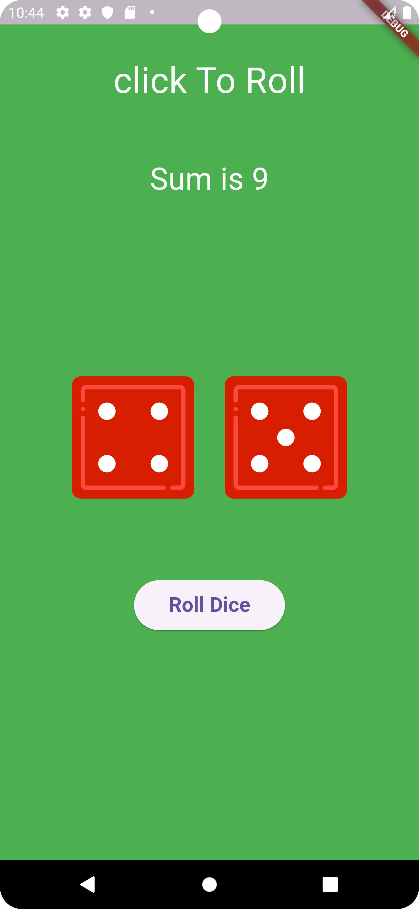

# Roll Dice Game

Roll Dice is a simple interactive game built with Flutter, allowing users to roll two dice by clicking a "Roll" button. The game dynamically updates the dice values and displays the sum of the numbers shown on the dice.
## Features
. Roll Dice: Click the "Roll" button to change the values on two dice.
. Sum Display: The app instantly calculates and displays the sum of the rolled dice.
. Provider State Management: Utilizes the Provider package to manage the state of the dice and UI updates.
## Technologies:
Flutter, Provider

## Screenshots

